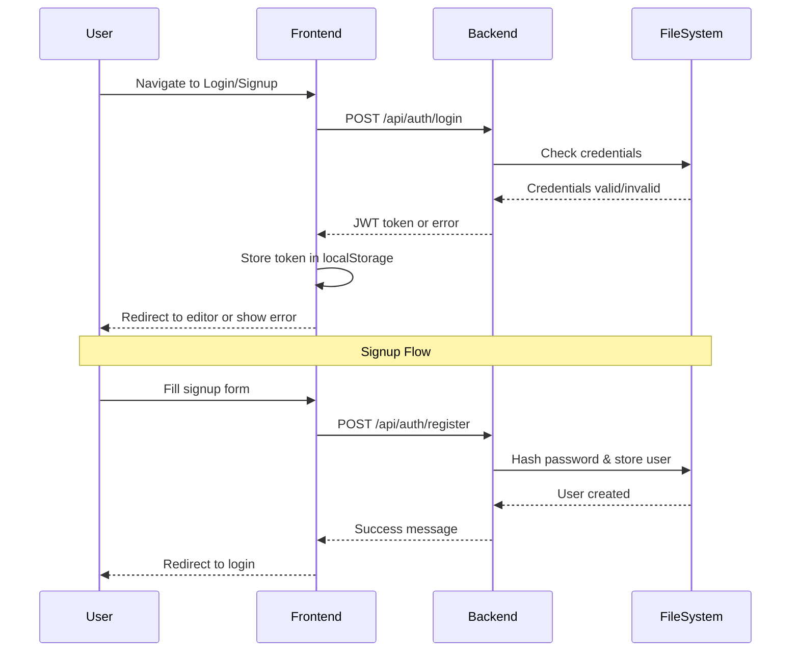
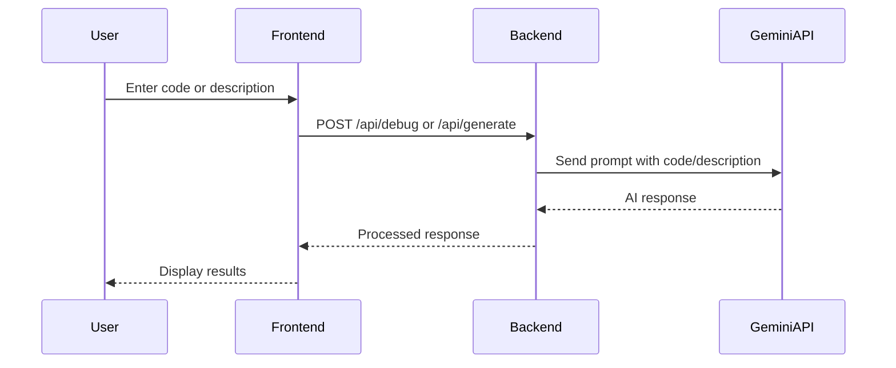

# CodeAI - Intelligent Coding Assistant


A powerful AI-powered code debugging, generation, and explanation assistant with a modern UI. This application helps developers debug their code, generate new code snippets, and understand complex code using the Gemini AI API.

## 📋 Table of Contents

- [Features](#features)
- [Tech Stack](#tech-stack)
- [Architecture](#architecture)
- [Authentication Flow](#authentication-flow)
- [Code Processing Flow](#code-processing-flow)
- [Setup Instructions](#setup-instructions)
- [Project Structure](#project-structure)
- [API Endpoints](#api-endpoints)
- [Contributing](#contributing)
- [License](#license)

## ✨ Features

- 🎨 **Modern UI**: Sleek monochromatic dark theme with blurred background effects
- 🔐 **Secure Authentication**: File-based user authentication system
- 💻 **Integrated Code Editor**: Syntax highlighting for multiple languages
- 🤖 **AI-Powered Features**:
  - Code debugging and error detection
  - Code generation from descriptions
  - Code explanation and documentation
- 📱 **Responsive Design**: Works on desktop and mobile devices
- 🌓 **Theme Support**: Dark mode by default

## 🛠️ Tech Stack

### Frontend
- **Framework**: React with TypeScript
- **UI Library**: Material-UI (MUI)
- **Code Editor**: CodeMirror
- **State Management**: React Context API
- **Routing**: React Router
- **HTTP Client**: Axios

### Backend
- **Runtime**: Node.js
- **Framework**: Express.js
- **AI Integration**: Google Gemini API
- **Authentication**: File-based with bcrypt
- **Data Storage**: JSON files

## 🏗️ Architecture

```
┌─────────────────┐     ┌─────────────────┐     ┌─────────────────┐
│                 │     │                 │     │                 │
│  React Frontend │◄────┤  Express Backend│◄────┤  Gemini AI API  │
│                 │     │                 │     │                 │
└─────────────────┘     └─────────────────┘     └─────────────────┘
        ▲                       ▲
        │                       │
        ▼                       ▼
┌─────────────────┐     ┌─────────────────┐
│                 │     │                 │
│  Local Storage  │     │  File System    │
│                 │     │                 │
└─────────────────┘     └─────────────────┘
```

## 🔐 Authentication Flow



## 🔄 Code Processing Flow



## 🚀 Setup Instructions

1. **Clone the repository**
   ```bash
   git clone https://github.com/yourusername/codeai.git
   cd codeai
   ```

2. **Install dependencies**
   ```bash
   # Install backend dependencies
   cd backend
   npm install

   # Install frontend dependencies
   cd ../frontend
   npm install
   ```

3. **Configure environment variables**
   Create a `.env` file in the backend directory:
   ```
   GEMINI_API_KEY=your_api_key_here
   PORT=5000
   ```

4. **Start the development servers**
   ```bash
   # Start backend server
   cd backend
   npm run dev

   # Start frontend server (in a new terminal)
   cd ../frontend
   npm start
   ```

5. **Access the application**
   Open your browser and navigate to `http://localhost:3000`

## 📁 Project Structure

```
codeai/
├── frontend/                # React frontend application
│   ├── public/              # Static assets
│   └── src/
│       ├── components/      # React components
│       │   ├── auth/        # Authentication components
│       │   └── ...          # Other components
│       ├── context/         # React context providers
│       │   ├── AuthContext.tsx
│       │   └── ThemeContext.tsx
│       ├── pages/           # Page components
│       ├── styles/          # CSS and styling files
│       ├── App.tsx          # Main application component
│       └── index.tsx        # Entry point
└── backend/                 # Node.js backend server
    ├── src/
    │   ├── auth/            # Authentication logic
    │   │   ├── authRoutes.js
    │   │   └── authService.js
    │   ├── routes/          # API routes
    │   ├── services/        # Business logic
    │   │   └── geminiService.js
    │   ├── utils/           # Utility functions
    │   └── index.js         # Server entry point
    ├── data/                # File-based data storage
    └── .env                 # Environment variables
```

## 🔌 API Endpoints

### Authentication
- `POST /api/auth/register` - Register a new user
- `POST /api/auth/login` - Login user
- `GET /api/auth/verify` - Verify authentication token

### Code Operations
- `POST /api/debug` - Debug code using AI
- `POST /api/generate` - Generate code from description
- `POST /api/execute` - Execute code (if supported)

## 🤝 Contributing

Contributions are welcome! Please feel free to submit a Pull Request.

1. Fork the repository
2. Create your feature branch (`git checkout -b feature/amazing-feature`)
3. Commit your changes (`git commit -m 'Add some amazing feature'`)
4. Push to the branch (`git push origin feature/amazing-feature`)
5. Open a Pull Request

## 📄 License

This project is licensed under the MIT License - see the LICENSE file for details.

---

<p align="center">Made with ❤️ by the CodeAI Team</p> 